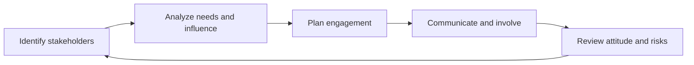

# Stakeholder Management Foundations

Stakeholder management is the practice of identifying the people and groups who
can affect or be affected by a project, understanding what they need, and
engaging them deliberately throughout delivery. In AI product work, this is not
optional. Data access, legal constraints, model behavior, adoption, fairness,
security, and business value all depend on people whose incentives may differ.

## Learning Objectives

By the end of this module, you should be able to:

- Explain what a stakeholder is in a product or project context.
- Distinguish stakeholder identification, analysis, engagement, and
  communication.
- Identify typical stakeholder groups in AI and software projects.
- Explain why stakeholder management is continuous rather than a one-time
  kickoff activity.
- Recognize common stakeholder risks in AI projects.

## Historical and Theoretical Context

Stakeholder thinking is strongly associated with R. Edward Freeman's 1984 book
`Strategic Management: A Stakeholder Approach`, which argued that organizations
should understand and manage relationships with groups beyond shareholders
alone. Project management adapted this idea into a delivery discipline: projects
are shaped not only by scope, time, and budget, but also by the people who make
decisions, provide constraints, use the outcome, fund it, support it, or resist
it.

Wikipedia's
[stakeholder analysis](https://en.wikipedia.org/wiki/Stakeholder_analysis)
article describes stakeholder analysis as a process for assessing a system and
its potential changes in relation to the interest and influence of relevant
parties. NN/g's stakeholder-analysis guidance adds a practical product lens:
stakeholder interviews help teams uncover goals, constraints, influence, and
organizational context before major product decisions are made.

The Association for Project Management distinguishes stakeholder engagement
from the idea that people can simply be "managed". Engagement is the systematic
identification, analysis, planning, and implementation of actions intended to
influence outcomes. This language is useful because stakeholders retain their
own agency, incentives, and decision rights.

In practice, stakeholder management is a loop:

The loop matters because stakeholders change. A legal reviewer may become more
urgent after a privacy question appears. A sales team may become more supportive
after seeing a prototype. A technical team may lose confidence when integration
risk grows.

## Stakeholder Types in AI Product Work

Stakeholders can be individuals, groups, departments, regulators, vendors,
partners, or users. A practical product manager should look beyond the obvious
decision makers.

| Stakeholder type | What they usually care about |
| --- | --- |
| End users | Usefulness, trust, usability, reliability, support |
| Customers or clients | Outcomes, cost, adoption, quality, contractual terms |
| Product leadership | Strategy, prioritization, differentiation, value |
| Engineering | Feasibility, architecture, maintainability, delivery risk |
| Data teams | Data quality, access, lineage, privacy, monitoring |
| Design and research | User needs, journeys, accessibility, evidence |
| Legal and compliance | Regulation, contracts, data protection, auditability |
| Security | Access control, threat models, incident response |
| Finance | Budget, ROI, pricing, operational cost |
| Sales and marketing | Positioning, launch timing, customer promises |
| Support and success | User questions, incident patterns, adoption blockers |
| Executives and sponsors | Strategic fit, risk, funding, decision speed |
| Regulators or works councils | Rights, transparency, fairness, compliance |
| Vendors and partners | Integration dependencies, service levels, roadmap fit |

## Why Stakeholder Management Matters More in AI

AI projects create stakeholder complexity because they often cross technical,
ethical, legal, and operational boundaries.

Common AI-specific stakeholder tensions:

- Business wants automation, while users want human oversight.
- Data teams know data quality limits, while sponsors expect fast delivery.
- Legal and compliance teams need transparency, while model behavior may be hard
  to explain.
- Finance wants measurable efficiency, while HR or support teams worry about
  fairness and trust.
- Engineering wants a maintainable system, while commercial teams want visible
  features quickly.

Good stakeholder management does not make conflict disappear. It makes conflict
visible early enough to handle with evidence and decisions.

The
[NIST AI Risk Management Framework](https://www.nist.gov/itl/ai-risk-management-framework)
reinforces this need for broad participation. AI risks can affect individuals,
organizations, and society, so teams need perspectives beyond the people who
build or purchase the system. Depending on the use case, this may include
affected communities, civil-society representatives, domain experts, auditors,
and people responsible for redress.

## Direct, Indirect, and Unrepresented Stakeholders

Not every affected stakeholder sits in a project meeting.

| Relationship | Example | Engagement question |
| --- | --- | --- |
| Direct | HR specialist using an AI recommendation | What does this person need to use the system responsibly? |
| Indirect | Applicant affected by screening | How can they understand, question, or appeal the outcome? |
| Represented | Works council speaking for employees | Does the representative have enough evidence and access? |
| Unrepresented | Future users or vulnerable groups | Who can bring their perspective into decisions? |

This distinction prevents a common error: treating the project's most visible
participants as the complete stakeholder landscape.

## Stakeholder Management Outputs

The work usually produces a small set of artifacts:

| Artifact | Purpose |
| --- | --- |
| Stakeholder register | Captures who matters, why they matter, and how to reach them. |
| Stakeholder map | Visualizes power, interest, attitude, or urgency. |
| Engagement strategy | Defines what relationship or behavior is needed. |
| Communication plan | Specifies message, channel, cadence, audience, and owner. |
| RACI matrix | Clarifies decision rights and delivery responsibilities. |
| Decision log | Records key decisions, rationale, owners, and follow-ups. |

These artifacts should stay lightweight. A stakeholder register that nobody
updates is less useful than a simple project board that makes follow-ups
visible.

## Common Failure Patterns

| Failure pattern | What happens |
| --- | --- |
| Only mapping senior leaders | Operational teams, users, and support constraints are missed. |
| Confusing interest with support | A highly interested stakeholder may still oppose the project. |
| Treating communication as broadcasting | Updates are sent, but nobody checks whether alignment exists. |
| Escalating too late | Conflicts become political because trade-offs were hidden. |
| Over-engaging everyone | Important people tune out because communication is not targeted. |
| Ignoring adoption stakeholders | The product ships but teams do not use or trust it. |

## Check Your Understanding

### Question 1

Why is stakeholder management a continuous loop rather than a one-time kickoff
task?

Show solution

Stakeholders, risks, attitudes, and information needs change during delivery. A
stakeholder who is low interest during discovery may become critical during
legal review, launch, adoption, or incident response.

### Question 2

Which stakeholder group is often missed when teams focus only on decision
makers?

Show solution

Operational stakeholders such as support, success, data operations, security,
and real end users are often missed. They may not approve budgets, but they
strongly affect adoption and delivery quality.

### Question 3

What is the difference between communication and engagement?

Show solution

Communication is the exchange of information. Engagement is the ongoing work of
building understanding, involvement, trust, and commitment. Sending an update is
communication; changing a skeptical stakeholder's confidence through evidence is
engagement.

### Question 4

Why are AI projects especially sensitive to stakeholder conflict?

Show solution

AI projects often touch sensitive data, fairness, explainability, regulation,
automation, user trust, and organizational change. These topics naturally create
different priorities across business, legal, technical, and user groups.

## Key Takeaways

- Stakeholder management is about relationships, decisions, risks, and trust.
- Stakeholders include more than sponsors and executives.
- AI projects need stronger stakeholder work because data, ethics, adoption, and
  governance concerns are distributed across many groups.
- The useful artifacts are simple but living: register, map, engagement plan,
  communication plan, RACI, and decision log.

## Further Reading

- [Stakeholder analysis](https://en.wikipedia.org/wiki/Stakeholder_analysis)
- [Stakeholder management](https://en.wikipedia.org/wiki/Stakeholder_management)
- [APM: Stakeholder engagement](https://www.apm.org.uk/resources/find-a-resource/stakeholder-engagement/)
- [NN/g: Stakeholder Analysis for UX Projects](https://www.nngroup.com/articles/stakeholder-analysis/)
- [NIST AI Risk Management Framework](https://www.nist.gov/itl/ai-risk-management-framework)
