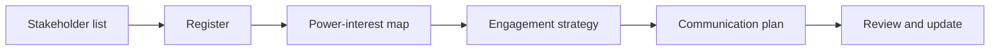
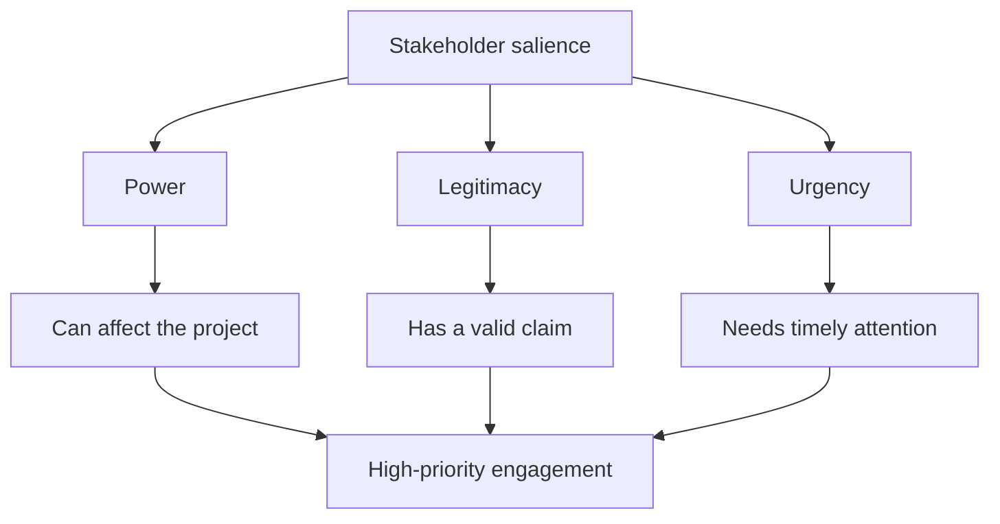

# Stakeholder Analysis and Mapping

Stakeholder analysis turns a list of names into a practical engagement strategy.
The goal is not to label people permanently. The goal is to understand whose
needs, influence, concerns, and support level matter for the next stage of the
project.

## Learning Objectives

By the end of this module, you should be able to:

- Build a stakeholder register for an AI product project.
- Use a power-interest matrix to decide engagement intensity.
- Add attitude and risk markers to make the map more useful.
- Compare power-interest mapping with stakeholder salience.
- Avoid common mapping mistakes.

## From Register to Map

Start with a stakeholder register. Keep it simple enough to maintain.

| Field | Why it matters |
| --- | --- |
| Name or group | Identifies the stakeholder clearly. |
| Role | Explains their relationship to the project. |
| Interest | Shows how much they care about the outcome. |
| Power or influence | Shows how much they can affect decisions or delivery. |
| Attitude | Captures current support, neutrality, or resistance. |
| Needs or concerns | Gives the reason behind their behavior. |
| Engagement strategy | Defines what the team should do next. |
| Owner | Makes follow-up accountable. |

Then translate the register into a map.

## Power-Interest Matrix

The power-interest matrix, often associated with Mendelow's matrix, helps teams
decide how much attention each stakeholder needs.

_Source: Wikimedia Commons, "Power-interest matrix.png" by VY-ProjM, CC0._

| Quadrant | Strategy | Practical meaning |
| --- | --- | --- |
| High power, high interest | Manage closely | Involve directly in decisions and trade-offs. |
| High power, low interest | Keep satisfied | Give concise, outcome-oriented updates and avoid surprises. |
| Low power, high interest | Keep informed | Maintain trust and capture useful context. |
| Low power, low interest | Monitor | Do not over-communicate, but watch for changes. |

Treat power as context-specific. A stakeholder may lack hierarchical authority
but still control critical data, specialist knowledge, regulatory approval,
adoption, or public legitimacy. Likewise, interest can change when a project
reaches a new phase.

## Add Attitude and Risk

Power and interest are not enough. A stakeholder can be highly interested and
strongly opposed. Another can have high power but little interest until a risk
appears.

Add simple markers:

| Marker | Meaning |
| --- | --- |
| `+` | Supportive |
| `0` | Neutral or unknown |
| `-` | Skeptical or opposed |
| `!` | Risk or urgent attention needed |
| `C` | Champion who can influence others |

Example:

| Stakeholder | Power | Interest | Attitude | Interpretation |
| --- | --- | --- | --- | --- |
| Legal lead | High | High | `- !` | Needs early involvement and evidence. |
| Support team | Medium | High | `+` | Strong adoption partner. |
| CFO | High | Medium | `0` | Needs value and cost clarity. |
| Pilot users | Low | High | `+` | Need feedback loops and expectation management. |

## Stakeholder Salience

Wikipedia's stakeholder analysis article also summarizes the salience model,
which classifies stakeholders using power, legitimacy, and urgency. This is
useful when a power-interest map hides why someone matters.

Use salience when:

- a low-power group has a legitimate ethical or legal claim;
- an issue is urgent even if the stakeholder is not senior;
- user harm, employee rights, data protection, or safety concerns are involved;
- you need to explain why a stakeholder deserves attention beyond hierarchy.

## Confidence and Evidence

Stakeholder maps contain assumptions. Record how confident the team is and what
evidence supports each placement.

| Confidence | Evidence example | Next action |
| --- | --- | --- |
| High | Direct interview and observed decision authority | Use the placement, then review at milestones. |
| Medium | Team experience and organization chart | Validate in the next stakeholder conversation. |
| Low | Assumption based on job title | Treat as a hypothesis and investigate quickly. |

Avoid presenting inferred attitudes as facts. Write "current hypothesis:
skeptical because..." rather than assigning a permanent label to a person.

## Review Triggers

Update the map when:

- project scope, sponsor, or team membership changes;
- a new risk or regulatory requirement appears;
- a prototype changes stakeholder interest;
- a decision is escalated;
- a stakeholder becomes a blocker or champion;
- the project moves from discovery to pilot, launch, or operations.

## Mapping in AI Product Scenarios

For AI products, include stakeholders around the model lifecycle:

| Lifecycle area | Stakeholders to consider |
| --- | --- |
| Problem framing | Users, product leadership, customer-facing teams |
| Data access | Data owners, legal, security, privacy, compliance |
| Model development | Data scientists, ML engineers, domain experts |
| Evaluation | QA, risk, fairness reviewers, user researchers |
| Integration | Platform teams, API owners, operations, vendors |
| Launch | Marketing, sales, support, training, customer success |
| Monitoring | Product analytics, incident response, governance groups |

## Common Mapping Mistakes

| Mistake | Better approach |
| --- | --- |
| Mapping job titles instead of people or groups | Name the actual decision maker or affected group. |
| Treating the map as objective truth | Treat it as a hypothesis and update it. |
| Ignoring negative stakeholders | Engage skeptics early, especially if they have power or legitimate concerns. |
| Confusing high interest with high power | A vocal group may still need advocacy from a sponsor. |
| Mapping without action | Every important stakeholder should have a next engagement step. |

## Check Your Understanding

### Question 1

Where should a high-power, high-interest stakeholder go on a power-interest map?

Show solution

They belong in the "manage closely" quadrant. They should be involved in key
decisions, trade-offs, and risk discussions.

### Question 2

Why add attitude markers to a stakeholder map?

Show solution

Power and interest do not show whether someone supports, resists, or is unsure
about the project. Attitude markers help decide where engagement effort should
go first.

### Question 3

When is stakeholder salience more useful than a simple power-interest map?

Show solution

Salience is useful when legitimacy or urgency matters as much as formal power,
such as employee rights, privacy, fairness, safety, or regulatory concerns.

### Question 4

What is the most important output of stakeholder mapping?

Show solution

The most important output is an engagement strategy. A map that does not change
communication, involvement, or decision planning is only decoration.

## Key Takeaways

- Stakeholder analysis starts with a register and becomes useful through a map.
- Power-interest mapping helps decide engagement intensity.
- Attitude, urgency, and legitimacy make stakeholder analysis more realistic.
- In AI projects, include data, legal, security, support, adoption, and user
  stakeholders early.

## Further Reading

- [Stakeholder analysis](https://en.wikipedia.org/wiki/Stakeholder_analysis)
- [Power-interest matrix on Wikimedia Commons](https://commons.wikimedia.org/wiki/File:Power-interest_matrix.png)
- [UK Government Analysis Function: Stakeholder mapping](https://analysisfunction.civilservice.gov.uk/policy-store/stakeholder-mapping/)
- [NN/g: Stakeholder Analysis for UX Projects](https://www.nngroup.com/articles/stakeholder-analysis/)
- [Mind the Product: Stakeholder mapping mistakes](https://www.mindtheproduct.com/stakeholder-mapping-avoid-these-3-mistakes/)
