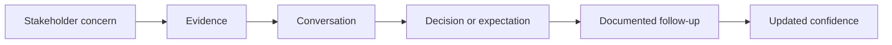
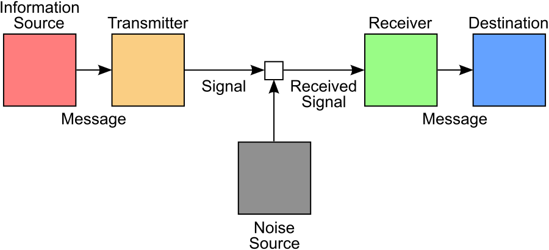
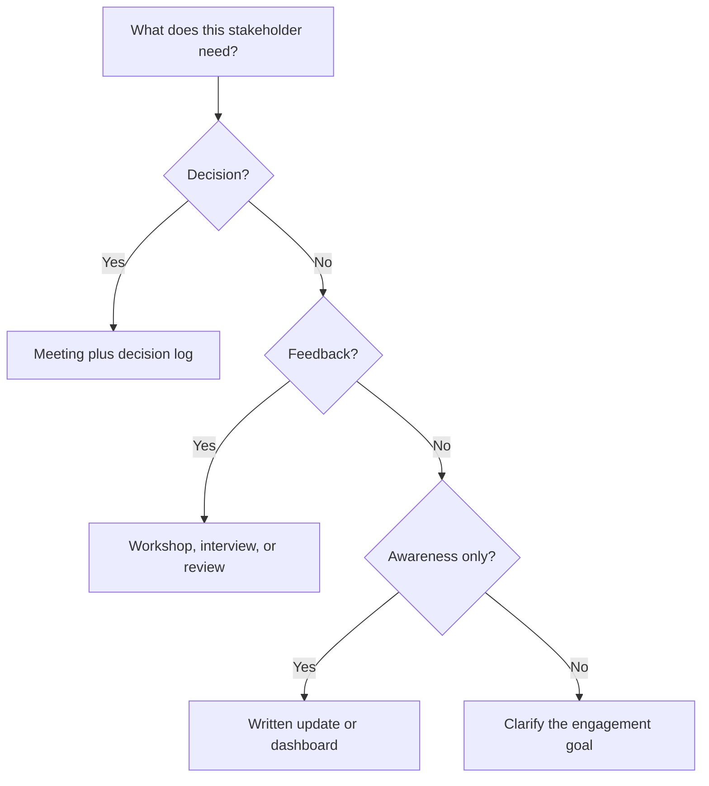

# Engagement and Communication Planning

A stakeholder map only becomes useful when it changes how the team communicates.
An engagement and communication plan defines who needs what information, why
they need it, how often they need it, through which channel, and who owns the
follow-up.

## Learning Objectives

By the end of this module, you should be able to:

- Translate stakeholder analysis into engagement actions.
- Distinguish communication needs by audience and decision type.
- Build a communication plan with audience, channel, cadence, message, and
  owner.
- Choose communication channels that fit power, interest, urgency, and risk.
- Manage conflicting stakeholder interests transparently.

## Engagement Is More Than Updates

Sending updates is not the same as engaging stakeholders. Engagement means
working toward the level of understanding, confidence, support, or involvement
the project needs.

For example, a legal team may not need more status updates. It may need a
decision session where data categories, retention rules, model explainability,
and audit logs are reviewed.

## Communication Theory: Message, Channel, Noise, Feedback

The Shannon-Weaver model was developed to describe information transmission.
It is not a complete model of human relationships, but it gives project teams a
useful diagnostic: a message passes through a channel, can be distorted by
noise, and may not be understood as intended.

_Source: Wikimedia Commons, "Shannon-Weaver model of communication.svg" by
Phlsph7, CC0._

In stakeholder work, "noise" can include:

- unexplained technical language;
- conflicting versions of a document;
- assumptions about what the audience already knows;
- organizational politics or low trust;
- inaccessible formats;
- a channel that does not support questions;
- missing context about the decision being requested.

Human communication also needs feedback. Ask stakeholders to restate decisions,
surface concerns, or confirm owners and deadlines. A message that was sent is
not necessarily a message that was understood.

## Communication Plan Structure

Use a compact table and update it as the project changes.

| Field | Example |
| --- | --- |
| Audience | Legal and compliance |
| Purpose | Review data protection and explainability risks |
| Message | What changed, decision needed, risk, recommendation |
| Channel | Decision workshop and written decision log |
| Cadence | At discovery, before pilot, before launch |
| Owner | Product lead |
| Evidence | DPIA draft, model card, data-flow diagram |
| Success signal | Decision recorded, open risks assigned |

## Communication Cadence

Different stakeholders need different levels of detail.

| Stakeholder group | Good cadence | Useful format |
| --- | --- | --- |
| Core product team | Daily or several times per week | Standup, project board, working docs |
| Sponsor | Weekly or milestone-based | Short status memo, risk/decision summary |
| Legal/security | Risk-triggered plus milestone reviews | Decision workshops, evidence packs |
| Users or pilot group | Research and pilot moments | Interviews, demos, feedback forms |
| Sales/support | Before external commitments and launch | Enablement notes, FAQs, training |
| Executives | Milestone-based | One-page briefing with decision asks |

## Match Channel to Need

Use synchronous formats for decisions, ambiguity, conflict, and trust-building.
Use asynchronous formats for awareness, reference material, and low-risk status
updates.

## Inclusive and Accessible Communication

Adapt communication to audience needs without making assumptions about ability,
language, time zone, or familiarity with the project.

- Share materials early enough for review.
- Use plain language and define necessary technical terms.
- Provide captions or transcripts for recorded material.
- Describe important diagrams rather than saying "as you can see".
- Record decisions in an accessible written format.
- Avoid relying on color alone to communicate status or risk.
- Offer an asynchronous feedback path for people who cannot attend live.

## Handling Conflicting Interests

Conflicting stakeholder expectations are normal. The product manager's job is
not to satisfy every request, but to make trade-offs explicit and aligned with
the product goal.

Use this sequence:

1. Name the conflict neutrally.
2. Identify each stakeholder's underlying concern.
3. Connect the decision to product goals and evidence.
4. Present options with trade-offs.
5. Recommend one path.
6. Record the decision and follow-ups.

Example:

| Conflict | Possible resolution |
| --- | --- |
| Sales wants a public launch date; engineering sees integration risk. | Commit to a pilot date and define launch criteria. |
| Legal wants strict review; product wants fast experimentation. | Separate sandbox experiments from production launch decisions. |
| Finance wants automation savings; users worry about trust. | Measure both efficiency and user confidence in the pilot. |

## Engagement Plan Quality Checklist

A strong plan answers:

- Who needs to be consulted before a decision?
- Who only needs to be informed?
- Which stakeholders need evidence, not persuasion?
- Which stakeholders need early involvement to prevent late blockers?
- Which stakeholder relationships are fragile or political?
- Which communication channel creates an auditable record?
- Who owns the next contact?

## Check Your Understanding

### Question 1

Why is a communication plan not just a list of meetings?

Show solution

Because meetings are only one communication channel. A good plan explains the
purpose, audience, cadence, evidence, owner, and desired outcome for each
communication.

### Question 2

When should a team prefer a synchronous meeting over an async update?

Show solution

Use a meeting when the team needs a decision, alignment on ambiguity, conflict
resolution, or trust-building. Use async updates for awareness and reference.

### Question 3

What is a good first step when two stakeholders want incompatible things?

Show solution

Name the conflict neutrally and identify the underlying concern behind each
position. This makes it easier to discuss trade-offs rather than personalities.

### Question 4

Why should legal, security, or compliance stakeholders often be engaged early in
AI projects?

Show solution

Because data protection, access control, explainability, auditability, and risk
requirements can change the design. Late review can create expensive rework or
block launch.

## Key Takeaways

- Communication is information exchange; engagement is relationship and
  commitment work.
- Cadence and channel should match stakeholder need, not team habit.
- Decision-heavy communication needs evidence and a recorded outcome.
- Conflict should be handled through goals, evidence, trade-offs, and decision
  logs.

## Further Reading

- [Mind the Product: Easy ways to engage your stakeholders](https://www.mindtheproduct.com/easy-ways-to-engage-your-stakeholders/)
- [APM: Communicate](https://www.apm.org.uk/resources/find-a-resource/stakeholder-engagement/key-principles/communicate/)
- [NN/g: Stakeholder Analysis for UX Projects](https://www.nngroup.com/articles/stakeholder-analysis/)
- [Shannon-Weaver model of communication](https://en.wikipedia.org/wiki/Shannon%E2%80%93Weaver_model)
- [Wikimedia Commons: Shannon-Weaver model](https://commons.wikimedia.org/wiki/File:Shannon-Weaver_model_of_communication.svg)
