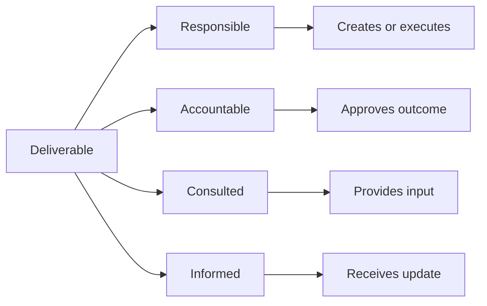
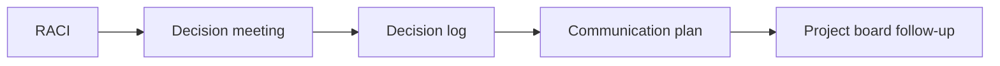

# RACI and Decision Ownership

Stakeholder management often breaks down because people are unclear about who
decides, who does the work, who must be consulted, and who only needs to be
kept informed. A RACI matrix is a lightweight way to clarify this for important
deliverables and decisions.

## Learning Objectives

By the end of this module, you should be able to:

- Explain the difference between Responsible, Accountable, Consulted, and
  Informed.
- Build a RACI matrix for product, technical, legal, and launch deliverables.
- Identify unhealthy RACI patterns.
- Choose when RACI is useful and when it becomes unnecessary process overhead.
- Connect RACI to stakeholder engagement and decision logs.

## RACI Basics

Wikipedia's
[responsibility assignment matrix](https://en.wikipedia.org/wiki/Responsibility_assignment_matrix)
article defines RACI as a model that describes participation by roles in
completing tasks or deliverables.

| Letter | Meaning | Practical test |
| --- | --- | --- |
| R | Responsible | Who does the work? |
| A | Accountable | Who owns the outcome and final call? |
| C | Consulted | Whose input is needed before completion? |
| I | Informed | Who needs to know the outcome? |

## RACI in AI Product Work

AI projects often involve ambiguous ownership. For example, who approves a
model's fairness criteria? Who signs off on a data source? Who explains model
limitations to customers? RACI makes these questions explicit.

Example matrix:

| Deliverable | Product Lead | ML Lead | Legal | Security | Support |
| --- | --- | --- | --- | --- | --- |
| Pilot success criteria | A/R | C | C | I | C |
| Approved data-source list | A | R | C | C | I |
| Model evaluation report | C | A/R | C | I | I |
| Data protection review | C | C | A/R | C | I |
| Launch support FAQ | A | C | C | I | R |

## Healthy RACI Rules

Use these rules as a quality check:

- Each deliverable should have one clear accountable role.
- Responsible work can be shared, but shared responsibility still needs
  coordination.
- Consulted stakeholders should be limited to people whose input changes the
  outcome.
- Informed stakeholders should not be invited into every working session.
- If everyone is consulted, nobody is actually prioritizing input.
- If nobody is accountable, decisions will drift.

Assign RACI to roles rather than individual names when possible. Roles survive
staff changes and make the matrix easier to reuse. Keep a separate owner or
contact field when the current person matters operationally.

## RACI Variants

Teams sometimes use variants when the standard model is too simple.

| Variant | Adds | Useful when |
| --- | --- | --- |
| RASCI | Supportive | Work needs contributors who assist but do not own completion. |
| DACI | Driver, Approver, Contributors, Informed | Product decisions need one driver and a clear approver. |
| RAPID | Recommend, Agree, Perform, Input, Decide | Decision-making needs more precision than task ownership. |

The variant matters less than the shared understanding it creates.

## Task Ownership Versus Decision Rights

RACI works best for deliverables. It can be less precise for decisions because
"Accountable" may combine recommendation, approval, and execution.

Use a decision-specific model when needed:

| Question | Possible role |
| --- | --- |
| Who frames the decision and drives it forward? | Driver |
| Who makes the final decision? | Approver or Decider |
| Who provides expertise or constraints? | Contributor or Consulted |
| Who executes the result? | Responsible or Perform |
| Who must know the outcome? | Informed |

Do not introduce a new acronym only because it exists. Use one model
consistently and define its terms at the top of the artifact.

## RACI Limitations

RACI can fail when it becomes too detailed or disconnected from real decisions.

| Problem | Better move |
| --- | --- |
| Matrix covers every tiny task | Use RACI only for key deliverables and decisions. |
| Multiple accountable roles | Choose one accountable role or split the deliverable. |
| Consulted list is too large | Separate required input from optional feedback. |
| Matrix is never updated | Review it at milestones and after role changes. |
| RACI replaces conversation | Use it to prepare conversations, not avoid them. |
| Names become outdated | Assign stable roles and maintain a current contact list. |
| Decision authority is unclear | Add an explicit decider or use DACI/RAPID. |

## Decision Log Connection

RACI clarifies who participates. A decision log captures what happened.

Minimum decision-log fields:

| Field | Example |
| --- | --- |
| Decision | Use approved policy documents only for the pilot. |
| Accountable owner | Product lead |
| Consulted | Legal, data owner, ML lead |
| Rationale | Reduces compliance and hallucination risk for first pilot. |
| Date | 2026-06-09 |
| Follow-up | Add document approval workflow to backlog. |

## Check Your Understanding

### Question 1

What is the difference between Responsible and Accountable?

Show solution

Responsible means doing the work. Accountable means owning the outcome and final
approval. One person or role should be clearly accountable for each deliverable.

### Question 2

Why is it risky to mark many people as Accountable for one deliverable?

Show solution

Shared accountability can hide who makes the final decision. If several roles
are truly accountable, the deliverable may need to be split.

### Question 3

When should someone be Consulted rather than Informed?

Show solution

Use Consulted when their input can change the outcome before completion. Use
Informed when they only need to know the decision or progress.

### Question 4

Why should RACI be connected to a decision log?

Show solution

RACI shows who participates, but the decision log records what was decided, why,
by whom, and what follow-up is needed. Together they reduce ambiguity.

## Key Takeaways

- RACI clarifies work ownership and decision rights.
- One clear accountable owner prevents drift.
- RACI is strongest for key deliverables, approvals, and cross-functional work.
- RACI should support engagement and decision-making, not replace conversation.

## Further Reading

- [Responsibility assignment matrix](https://en.wikipedia.org/wiki/Responsibility_assignment_matrix)
- [Asana: RACI chart guide](https://asana.com/resources/raci-chart)
- [Miro: RACI matrix template](https://miro.com/templates/raci-matrix/)
