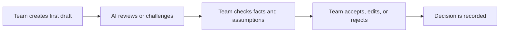
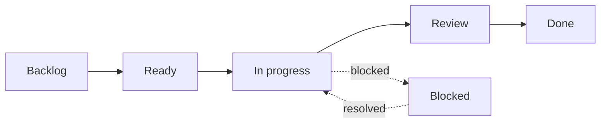
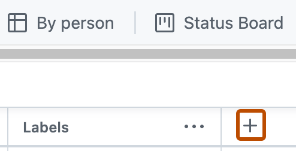
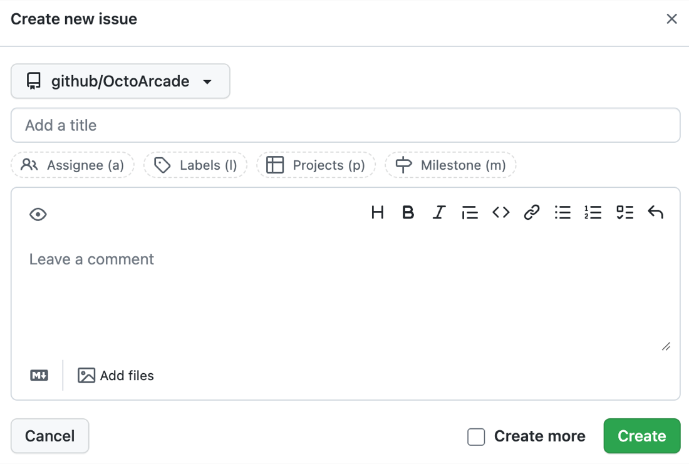
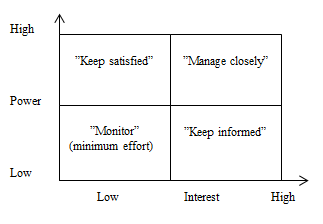
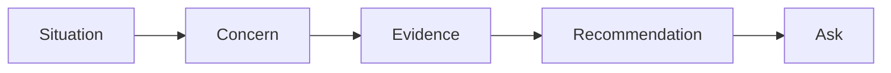

# Session Handout: Stakeholder Management Workshop

This workshop turns stakeholder theory into a practical delivery workflow. Your
group will use GitHub Projects to track stakeholder work and a conversational
AI assistant as a project-management collaborator.

## Workshop Overview

During the workshop, your group will:

1. Choose an AI product scenario.
2. Create a GitHub Projects board and workshop backlog.
3. Use ChatGPT, Claude, or Gemini to review the backlog.
4. Conduct stakeholder role-play interviews.
5. Use AI to simulate an additional stakeholder perspective.
6. Build a stakeholder register and power-interest map.
7. Ask AI to identify missing stakeholders and unsupported assumptions.
8. Create an engagement and communication plan.
9. Build a RACI matrix and analyze stakeholder conflicts.
10. Use AI to stress-test these project artifacts.
11. Prepare a three-minute stakeholder decision briefing.
12. Rehearse it with AI acting as a skeptical stakeholder.
13. Present to peers and incorporate their feedback.
14. Maintain an AI collaboration log recording which suggestions were accepted,
    edited, or rejected.

Use the official GitHub documentation as the reference for Project setup:

- [Quickstart for Projects](https://docs.github.com/en/issues/planning-and-tracking-with-projects/learning-about-projects/quickstart-for-projects)
- [Creating a project](https://docs.github.com/en/issues/planning-and-tracking-with-projects/creating-projects/creating-a-project)
- [Adding items to your project](https://docs.github.com/en/issues/planning-and-tracking-with-projects/managing-items-in-your-project/adding-items-to-your-project)
- [Customizing the board layout](https://docs.github.com/en/issues/planning-and-tracking-with-projects/customizing-views-in-your-project/customizing-the-board-layout)

## Working with an AI Assistant

Each group should use one conversational AI assistant:

- [ChatGPT](https://help.openai.com/en/articles/9125172)
- [Claude](https://support.claude.com/en/articles/8114491-getting-started-with-claude)
- [Gemini](https://support.google.com/gemini?hl=en)

No coding agent, terminal integration, or paid feature is required. Choose a
tool available to the group and assign one participant as the **AI operator**.
Rotate this role between activities so that everyone practices giving context,
reviewing output, and making decisions.

Use AI as a reviewer, simulator, and thinking partner rather than an answer
generator:



Follow these rules throughout the workshop:

1. Do the initial thinking as a group before asking AI.
2. Give the assistant the scenario and only the context needed for the task.
3. Do not enter personal, confidential, or sensitive organizational data.
4. Treat simulated stakeholder responses as hypotheses, not real evidence.
5. Ask the assistant to separate scenario facts, assumptions, and unknowns.
6. The group owns every final rating, recommendation, and decision.
7. Record important AI contributions in the AI collaboration log.

Start a new conversation and use this shared context:

```text
You are supporting our stakeholder-management workshop as a critical thinking
partner.

Project scenario:
[Paste the selected scenario.]

Help us identify assumptions, missing perspectives, contradictions, and risks.
Do not make final project decisions for us.

In every response, distinguish:
- facts stated in the scenario;
- reasonable hypotheses;
- information that requires stakeholder validation.

Keep your answers concise. Explain uncertainty and ask questions when context
is missing.
```

## Scenario Options

Choose one scenario.

### Scenario A: AI Dynamic Pricing for Mobility

A mobility company wants an AI-powered dynamic pricing system for car rentals.
The system should adjust prices using demand, fleet availability, seasonality,
competitor pricing, and external events. The current process relies on manual
adjustments and basic rules.

Key concerns:

- integration with booking and CRM systems;
- GDPR-compliant use of customer and transaction data;
- transparency around pricing decisions;
- risk of customer distrust if prices feel unfair;
- dashboard needs for pricing managers;
- a fixed launch milestone before a high-demand event.

### Scenario B: AI Decision Support for HR

An HR software provider wants to add AI-assisted decision support for
recruitment, performance, and compensation workflows. The system should
automate administrative work, provide explainable recommendations, and support
controlled pilot testing before a wider rollout.

Key concerns:

- sensitive employee and applicant data;
- fairness and explainability of recommendations;
- labour law and GDPR constraints;
- union or employee-representative concerns;
- integration with payroll, recruiting, and performance modules;
- need for human oversight and auditability.

## Part 1: Create the GitHub Project

Create or open the repository for your group. Then create a GitHub Project named
`Stakeholder Management Workshop`.


_Source: GitHub Docs, "Quickstart for Projects"._

Use a board view with these columns:



Create fields:



_Source: GitHub Docs, "Quickstart for Projects"._

| Field | Type | Suggested values |
| --- | --- | --- |
| Workstream | Single select | Register, Map, Engagement, RACI, Briefing |
| Stakeholder type | Single select | User, Business, Technical, Legal, Data, External |
| Power | Single select | High, Medium, Low |
| Interest | Single select | High, Medium, Low |
| Attitude | Single select | Supportive, Neutral, Skeptical, Unknown |
| Owner | Assignee | One responsible person |

Set a column limit on **In progress**. Use `3` for larger groups and `2` for
smaller groups.


_Source: GitHub Docs, "Customizing the board layout"._

<details>
<summary>Show example setup</summary>

By the end of Part 1, the group should have:

- one Project board;
- columns for Backlog, Ready, In progress, Review, Blocked, and Done;
- fields for stakeholder analysis;
- all group members able to see and update the board.

</details>

## Part 2: Create Workshop Issues

Create issues for the workshop tasks and add them to the Project.



_Source: GitHub Docs, "Adding items to your project"._

Use this issue structure:

```text
Title:

Purpose:

Done when:
- ...
- ...

Stakeholders involved:

Decision or follow-up needed:
```

Suggested issues:

| Issue | Workstream |
| --- | --- |
| Select scenario and product goal | Register |
| Identify stakeholder groups | Register |
| Run stakeholder interview role-play | Register |
| Create stakeholder register | Register |
| Build power-interest map | Map |
| Mark attitude and risks | Map |
| Draft engagement plan | Engagement |
| Build RACI matrix | RACI |
| Identify top three stakeholder conflicts | Engagement |
| Prepare three-minute stakeholder briefing | Briefing |
| Revise plan after feedback | Briefing |
| Maintain AI collaboration log | Briefing |

### AI Checkpoint 1: Review the Backlog

Create the first backlog as a group. Then ask the assistant to review it:

```text
Review our proposed workshop backlog.

Identify:
- missing stakeholder-management tasks;
- tasks that are too broad to complete;
- acceptance criteria that cannot be verified;
- dependencies or decisions we have overlooked.

Return findings and questions. Do not rewrite the backlog.
```

Discuss the response and update only the issues the group agrees should change.
Record at least one accepted, edited, or rejected suggestion in the AI
collaboration log.

<details>
<summary>Show example issue</summary>

```text
Title: Build power-interest map

Purpose:
Visualize who needs close management, satisfaction, information, or monitoring.

Done when:
- At least 10 stakeholders are placed on the map.
- Each placement includes a short justification.
- Skeptical or risky stakeholders are marked.
- The map is reviewed by the group.

Stakeholders involved:
Product lead, legal lead, engineering lead, pilot users, sponsor.

Decision or follow-up needed:
Agree which three stakeholders need the most engagement effort this week.
```

</details>

## Part 3: Stakeholder Interview Role-Play

Before finalizing the register, practice stakeholder interviews instead of
relying only on the project team's assumptions.

Assign each group member one scenario role:

- sponsor or executive;
- legal, compliance, or employee representative;
- technical or data lead;
- user, customer, or operational team member.

The interviewer has five minutes per stakeholder. Ask:

1. What outcome matters most to you?
2. What are you worried could go wrong?
3. Which decisions do you expect to influence or approve?
4. What evidence would increase your confidence?
5. How and when do you want to be involved?
6. Who else should the project team speak with?

Both peer and AI role-play produce simulated statements, not real stakeholder
evidence. They help the team formulate hypotheses and prepare better questions
for actual stakeholder research. Record the source of each statement and keep
it separate from the team's interpretation.

| Simulated statement and source | Team interpretation | Validation needed |
| --- | --- | --- |
|  |  |  |
|  |  |  |
|  |  |  |

### AI Checkpoint 2: Simulate an Additional Stakeholder

Complete at least one human role-play first. Then ask the assistant to simulate
one stakeholder who was not represented by a group member.

```text
Act as [stakeholder role] in the selected scenario.

Stay within the information in the scenario and reasonable concerns associated
with this role. Label every inference as a hypothesis.

Answer one interview question at a time. Challenge vague claims, ask for
evidence, and do not make project decisions for us.
```

Label the source as **AI simulation**. Treat every resulting concern as a
hypothesis requiring validation with a real stakeholder.

<details>
<summary>Show example interview notes</summary>

```text
Stakeholder:
Union representative

Simulated statements:
Wants employees to know when AI contributes to a recommendation.
Needs a clear path for challenging incorrect information.
Expects consultation before the pilot begins.

Interpretation:
High interest, medium formal power, high legitimacy, currently skeptical.

Validation needed:
Share the human-oversight workflow and invite review of the pilot FAQ.
```

</details>

## Part 4: Stakeholder Register

Create a register for at least 12 stakeholders.

| Stakeholder | Type | Need or concern | Power | Interest | Attitude | Owner |
| --- | --- | --- | --- | --- | --- | --- |
|  |  |  |  |  |  |  |
|  |  |  |  |  |  |  |
|  |  |  |  |  |  |  |

<details>
<summary>Show example register entries</summary>

Scenario B example:

| Stakeholder | Type | Need or concern | Power | Interest | Attitude | Owner |
| --- | --- | --- | --- | --- | --- | --- |
| HR Director | Business | Efficient and compliant HR workflows | High | High | Supportive | Product lead |
| Legal counsel | Legal | GDPR and labour-law compliance | High | High | Skeptical | Product lead |
| Union representative | External | Employee rights and fairness | Medium | High | Skeptical | Stakeholder lead |
| ML lead | Technical | Feasible model evaluation and explainability | Medium | High | Supportive | Tech lead |
| Finance partner | Business | Accurate compensation insights | High | Medium | Neutral | Product lead |

</details>

## Part 5: Power-Interest Map

Place stakeholders into the matrix.



_Source: Wikimedia Commons, "Power-interest matrix.png" by VY-ProjM, CC0._

Use attitude markers:

| Marker | Meaning |
| --- | --- |
| `+` | Supportive |
| `0` | Neutral or unknown |
| `-` | Skeptical or opposed |
| `!` | Risk or urgency |
| `C` | Champion |

<details>
<summary>Show example map interpretation</summary>

Scenario A example:

| Quadrant | Stakeholders | Engagement action |
| --- | --- | --- |
| Manage closely | Sponsor, pricing director, legal lead | Weekly decision session and risk review |
| Keep satisfied | CFO, regional operations director | Concise business-value and launch-risk updates |
| Keep informed | Customer support, pilot branch managers | Demo notes, FAQ, feedback channel |
| Monitor | General internal teams | Milestone announcements only |

The legal lead may be marked `- !` if they are skeptical and can block launch
without evidence on GDPR and pricing transparency.

</details>

### AI Checkpoint 3: Audit the Register and Map

Complete the register and map before consulting the assistant. Paste only the
content needed for review:

```text
Audit our stakeholder register and power-interest map.

Identify:
- affected groups we may have missed;
- ratings that are unsupported by the scenario;
- contradictions between needs, attitude, power, and engagement;
- people affected by the product who lack representation;
- assumptions that require a real stakeholder interview.

Return findings and questions. Do not rewrite our artifacts.
```

The group decides whether each finding should be accepted, edited, or rejected.
Do not add a stakeholder merely because the assistant suggested one.

## Part 6: Engagement and Communication Plan

Build a plan for your top stakeholder groups.

| Audience | Purpose | Message | Channel | Cadence | Owner | Evidence |
| --- | --- | --- | --- | --- | --- | --- |
|  |  |  |  |  |  |  |
|  |  |  |  |  |  |  |
|  |  |  |  |  |  |  |

<details>
<summary>Show example communication plan</summary>

Scenario B example:

| Audience | Purpose | Message | Channel | Cadence | Owner | Evidence |
| --- | --- | --- | --- | --- | --- | --- |
| Legal | Compliance review | Data use, audit logs, explainability | Decision workshop | Before pilot and launch | Product lead | Data-flow diagram, DPIA draft |
| HR pilot users | Adoption feedback | What the assistant can and cannot decide | Demo and feedback form | Every pilot sprint | Research lead | Prototype, feedback summary |
| Finance | Compensation confidence | Accuracy limits and review process | One-page memo | Milestones | Product lead | Evaluation report |
| Union reps | Trust and rights | Human oversight and employee protections | Listening session | Before pilot | Sponsor | Policy draft, FAQ |

</details>

## Part 7: RACI Matrix

Create a RACI matrix for at least six deliverables.

| Deliverable | Product Lead | Tech Lead | Legal | Sponsor | Users |
| --- | --- | --- | --- | --- | --- |
|  |  |  |  |  |  |
|  |  |  |  |  |  |
|  |  |  |  |  |  |

<details>
<summary>Show example RACI</summary>

Scenario A example:

| Deliverable | Product Lead | ML Lead | Legal | Pricing Lead | Sponsor |
| --- | --- | --- | --- | --- | --- |
| Pilot scope | A/R | C | C | C | I |
| Approved data sources | A | R | C | C | I |
| Pricing fairness criteria | C | C | A/R | C | I |
| Model evaluation report | C | A/R | C | C | I |
| Launch decision | R | C | C | C | A |
| Staff training | A | C | I | R | I |

If multiple people appear as `A` for one deliverable, split the deliverable or
agree who owns the final decision.

</details>

## Part 8: Conflict Strategy

Identify your top three stakeholder conflicts.

| Conflict | Stakeholders | Underlying concerns | Evidence needed | Recommended trade-off |
| --- | --- | --- | --- | --- |
|  |  |  |  |  |
|  |  |  |  |  |
|  |  |  |  |  |

<details>
<summary>Show example conflict strategy</summary>

| Conflict | Stakeholders | Underlying concerns | Evidence needed | Recommended trade-off |
| --- | --- | --- | --- | --- |
| Fast launch vs compliance | Sponsor, legal | Market timing vs legal exposure | Data-flow diagram, DPIA, audit approach | Pilot with approved data only |
| Automation vs human oversight | HR, union reps | Efficiency vs employee rights | Human-in-the-loop workflow | AI recommends, humans decide |
| Model accuracy vs explainability | ML, business users | Performance vs trust | Evaluation report and examples | Prefer explainable baseline for pilot |

</details>

### AI Checkpoint 4: Stress-Test the Plan

After completing Parts 6 to 8, ask the assistant to review the artifacts
together:

```text
Stress-test our communication plan, RACI matrix, and conflict strategy.

Look for:
- stakeholders with no meaningful engagement action;
- messages that do not address the audience's actual concern;
- unclear ownership or multiple accountable roles;
- conflicts hidden by vague wording;
- recommendations that need stronger evidence.

For each finding, explain the risk and ask one question that would help us
resolve it. Do not produce replacement artifacts.
```

Resolve the most important finding as a group and record the decision.

## Part 9: Stakeholder Briefing

Prepare a three-minute briefing for one important stakeholder group.

```text
Audience:

Decision or alignment needed:

Current situation:

Core evidence:

Recommendation:

Trade-off:

Ask:
```

Use this flow:



### AI Checkpoint 5: Rehearse with a Skeptical Stakeholder

Give the assistant the audience and your draft briefing:

```text
Act as a skeptical [executive, legal representative, user, employee
representative, or other selected stakeholder].

Listen to our briefing and:
1. ask five difficult questions;
2. identify unsupported claims;
3. assess whether the recommendation, trade-off, and ask are clear;
4. state what evidence would increase your confidence.

Do not rewrite the briefing.
```

Revise the briefing only after discussing the critique. Keep any challenge the
group cannot yet answer as an open question rather than inventing evidence.

<details>
<summary>Show example briefing</summary>

```text
Audience:
Legal and compliance.

Decision or alignment needed:
Confirm whether the pilot can use approved policy documents and anonymized
usage logs.

Current situation:
The team can demonstrate a useful assistant in four weeks, but only if data
approval is resolved this week.

Core evidence:
The pilot uses a restricted document set, audit logs, role-based access, and a
feedback process for incorrect answers.

Recommendation:
Approve a controlled pilot using approved documents only. Exclude employee
personal data from the first pilot.

Trade-off:
The first pilot is narrower, but compliance risk and rework risk are lower.

Ask:
Approve the pilot data scope by Friday and nominate one legal reviewer for the
pilot review board.
```

</details>

## Part 10: Peer Feedback and Revision

Each group presents for three minutes. The listening group gives feedback using
this format:

| Feedback question | Notes |
| --- | --- |
| Was the stakeholder need clear? |  |
| Was the recommendation specific? |  |
| Was the evidence convincing? |  |
| Were trade-offs honest? |  |
| Was the ask actionable? |  |

<details>
<summary>Show example feedback</summary>

Useful feedback:

- "The ask was clear, but the stakeholder concern should be stated earlier."
- "The recommendation is specific, but the evidence needs one concrete metric."
- "The trade-off is honest. Add who owns the next step."

Less useful feedback:

- "Looks good."
- "Make it more strategic."
- "Maybe add more detail."

</details>

## Part 11: AI Collaboration Log

Document the important AI interactions. Record decisions, not full chat
transcripts.

| Activity | AI contribution | Assumption or risk found | Team decision | Reason |
| --- | --- | --- | --- | --- |
|  |  |  | Accepted, edited, or rejected |  |
|  |  |  | Accepted, edited, or rejected |  |
|  |  |  | Accepted, edited, or rejected |  |

<details>
<summary>Show example AI collaboration log</summary>

| Activity | AI contribution | Assumption or risk found | Team decision | Reason |
| --- | --- | --- | --- | --- |
| Backlog review | Suggested a task for employee consultation | The scenario mentions union concerns but not a consultation step | Accepted | Consultation is necessary before defining the pilot engagement plan |
| Register audit | Rated the regulator as high power | No regulator involvement is stated in the scenario | Edited | Added the regulator as a hypothesis and assigned an owner to validate relevance |
| RACI review | Flagged two accountable roles for pilot approval | Sponsor and legal were both marked `A` | Accepted | Sponsor owns the pilot decision; legal is consulted and retains its formal approval duties |
| Briefing rehearsal | Asked for a fairness threshold | The team had claimed the model was fair without a defined measure | Accepted | Removed the unsupported claim and added the threshold as an open decision |

</details>

## Final Deliverables

By the end of the workshop, your group should have:

- a GitHub Projects board with workshop issues;
- role-play notes that distinguish simulated statements from interpretation;
- a stakeholder register;
- a power-interest map with attitude markers;
- an engagement and communication plan;
- a RACI matrix;
- a top-three conflict strategy;
- a three-minute stakeholder briefing;
- a revised plan after AI and peer feedback;
- an AI collaboration log showing accepted, edited, and rejected suggestions.
