# Stakeholder Management

This repository is a learning path for managing stakeholders in AI and software
product work. You will identify the people affected by a product,
analyze their power, interest, attitude, and expectations, define engagement
strategies, clarify responsibilities with RACI, and present decisions in a way
that builds alignment.

## Project at a Glance

The project builds a practical stakeholder system that connects analysis,
decision ownership, engagement, and communication.

```mermaid
%%{init: {"theme":"base","themeVariables":{"fontFamily":"Arial","primaryTextColor":"#172033","lineColor":"#64748B"},"flowchart":{"curve":"basis","nodeSpacing":36,"rankSpacing":52}}}%%
flowchart LR
    Goal[Build alignment around<br/>an AI product decision]
    subgraph Discover["<b>1. Discover the Stakeholder Landscape</b>"]
        direction TB
        Context[Product context<br/>and affected people]
        Internal[Internal decision makers]
        External[External partners<br/>and regulators]
        Affected[Affected users<br/>and communities]
        Map[Power, interest,<br/>attitude and salience map]
        Context --> Internal
        Context --> External
        Context --> Affected
        Internal --> Map
        External --> Map
        Affected --> Map
    end
    subgraph Plan["<b>2. Plan Engagement and Ownership</b>"]
        direction TB
        Strategy[Engagement and<br/>communication plan]
        RACI[RACI and decision rights]
        Risks[Conflicts, risks<br/>and escalation paths]
        Ready[Aligned ownership<br/>and engagement plan]
        Strategy --> Ready
        RACI --> Ready
        Risks --> Ready
    end
    subgraph Align["<b>3. Communicate and Maintain Alignment</b>"]
        direction TB
        Board[Track follow-ups and<br/>decisions in GitHub Projects]
        Briefing[Deliver a concise<br/>stakeholder briefing]
        Output[Shared asks, owners<br/>and next actions]
        Board --> Output
        Briefing --> Output
        Output -. Feedback .-> Board
    end
    Goal --> Discover --> Plan --> Align
    classDef goal fill:#172033,color:#FFFFFF,stroke:#172033,stroke-width:2px;
    classDef input fill:#FFFFFF,color:#172033,stroke:#4677A8,stroke-width:1.5px;
    classDef work fill:#FFFFFF,color:#172033,stroke:#3B8A5A,stroke-width:1.5px;
    classDef output fill:#FFFFFF,color:#172033,stroke:#B77A1F,stroke-width:1.5px;
    class Goal goal;
    class Context,Internal,External,Affected,Map input;
    class Strategy,RACI,Risks,Ready work;
    class Board,Briefing,Output output;
    style Discover fill:#F5F9FD,stroke:#9BB8D2,stroke-width:1.5px;
    style Plan fill:#F4FAF6,stroke:#9DC8AD,stroke-width:1.5px;
    style Align fill:#FFFAEF,stroke:#D7B66B,stroke-width:1.5px;
```



## Learning Objectives

By the end of this repository, you should be able to:

- Identify internal, external, executive, regulatory, and user stakeholders in
  an AI product scenario.
- Use stakeholder analysis to understand power, interest, attitude, urgency,
  and project risk.
- Build a stakeholder map and translate it into a communication and engagement
  plan.
- Clarify decision rights and delivery responsibilities with a RACI matrix.
- Handle conflicting stakeholder expectations with evidence, trade-offs, and
  escalation paths.
- Prepare a concise stakeholder presentation that uses structure, storytelling,
  and clear asks.
- Use a conversational AI assistant to challenge project assumptions, simulate
  stakeholder perspectives, review planning artifacts, and rehearse a briefing
  while retaining human decision ownership.
- Use GitHub Projects to track stakeholder work, communication follow-ups, and
  decisions throughout the workshop.

## Learning Path

The modules build on each other in order.

| File / Folder | Description |
|---|---|
| [**01 - Stakeholder Management Foundations**](01-stakeholder-management-foundations.md) | Understand stakeholder theory, stakeholder types, and why engagement matters in AI projects. |
| [**02 - Stakeholder Analysis and Mapping**](02-stakeholder-analysis-and-mapping.md) | Build stakeholder registers, power-interest maps, attitude markers, and salience views. |
| [**03 - Engagement and Communication Planning**](03-engagement-and-communication-planning.md) | Turn analysis into communication channels, cadence, ownership, and engagement strategy. |
| [**04 - RACI and Decision Ownership**](04-raci-and-decision-ownership.md) | Clarify who is responsible, accountable, consulted, and informed for key deliverables. |
| [**05 - Presentation and Storytelling**](05-presentation-and-storytelling.md) | Prepare persuasive stakeholder updates, decision briefings, and short presentations. |
| [**06 - Session Handout**](06-session-handout.md) | Run the group workshop using GitHub Projects, conversational AI, stakeholder scenarios, and example solutions. |

### Additional Folders and Files

| File / Folder | Description |
|---|---|
| [**assets**](assets/) | Local sourced illustrations and GitHub Projects screenshots used in the lessons and handout. |

## Setup

> [!NOTE]
> Throughout these steps, text in angle brackets like `<repo-name>` is a
> placeholder. Replace it including the `< >` brackets with your own value.
> For example, `cd <repo-name>` becomes `cd aipm-stakeholder-management`.

### 1. Create the Repository from the Template

Click **Use this template** on GitHub.

When creating the repository:

- Set yourself as the **Owner**
- Choose a repository name
- Disable **Include all branches**
- Click **Create repository**

> [!IMPORTANT]
> If you are working in pairs or groups, only one person should complete this
> step.

---

### 2. Add Collaborators (Pairs/Groups Only)

If working with teammates:

1. Open the repository on GitHub
2. Go to **Settings -> Collaborators**
3. Add your teammates as collaborators
4. Share the repository link with your team

Teammates should accept the invitation before continuing.

---

### 3. Clone the Repository

Copy the SSH URL from the **Code** button on GitHub, then run:

```bash
git clone <copied-ssh-url>
```

The copied SSH URL will look like:
`git@github.com:<your-username>/<repo-name>.git`.

---

### 4. Move into the Project Folder

No Python environment is required for this repository.

```bash
cd <repo-name>
```

---

### 5. Open the Lesson Files

Open `README.md` and follow the lesson files in numerical order. The files are
plain Markdown and can be read directly on GitHub or in a local editor.

## References & Further Reading

- [**Stakeholder analysis**](https://en.wikipedia.org/wiki/Stakeholder_analysis):
  Orientation on stakeholder types, mapping, power-interest grids, and salience.
- [**Stakeholder management**](https://en.wikipedia.org/wiki/Stakeholder_management):
  Orientation on stakeholder engagement as a continuous project process.
- [**NN/g: Stakeholder Analysis for UX Projects**](https://www.nngroup.com/articles/stakeholder-analysis/):
  Practical guidance for stakeholder interviews, alignment, and user-centered
  product work.
- [**APM: Stakeholder engagement**][apm-stakeholder-engagement]:
  Professional guidance on identification, analysis, communication,
  negotiation, and relationship building.
- [**NIST AI Risk Management Framework**](https://www.nist.gov/itl/ai-risk-management-framework):
  Authoritative guidance for involving diverse perspectives in AI risk
  management.
- [**Responsibility assignment matrix**](https://en.wikipedia.org/wiki/Responsibility_assignment_matrix):
  Orientation on RACI and related responsibility models.

[apm-stakeholder-engagement]: https://www.apm.org.uk/resources/find-a-resource/stakeholder-engagement/
